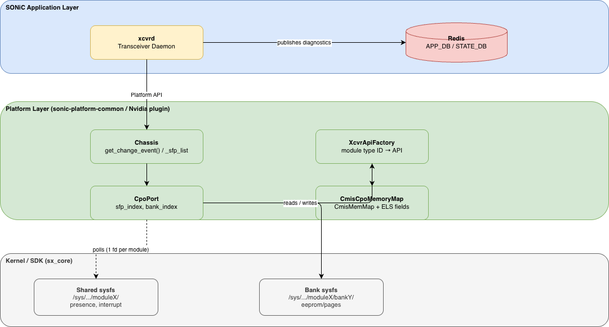
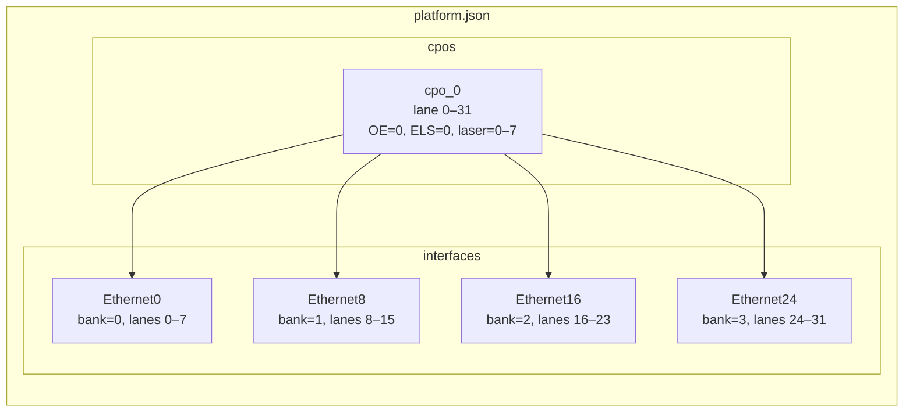
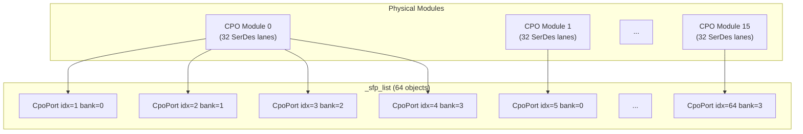
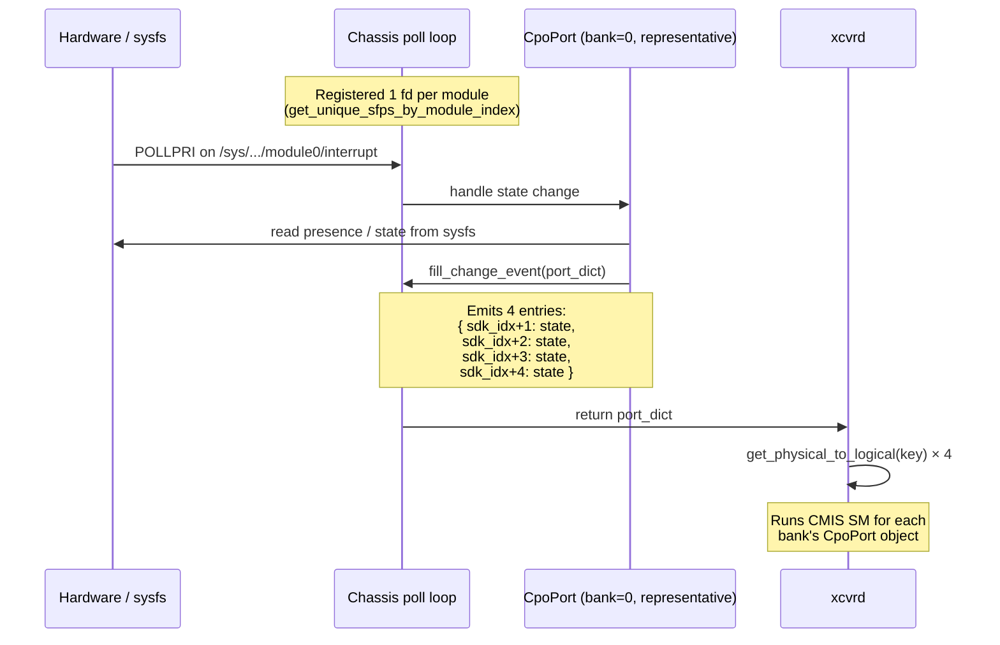
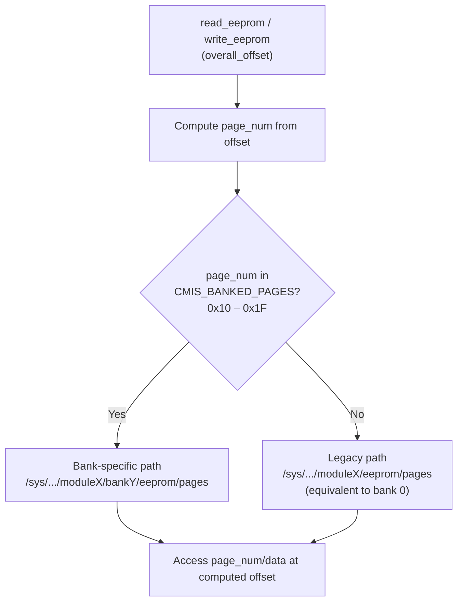
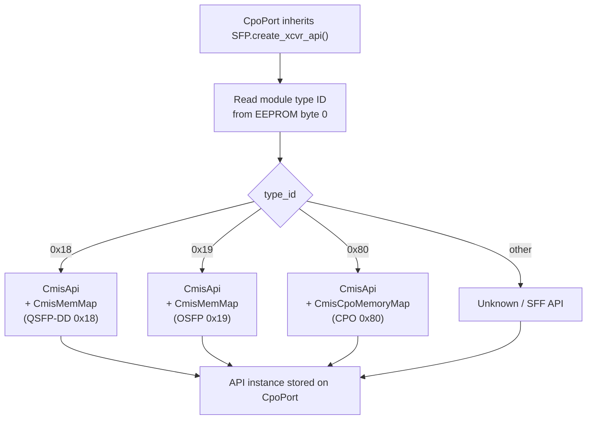
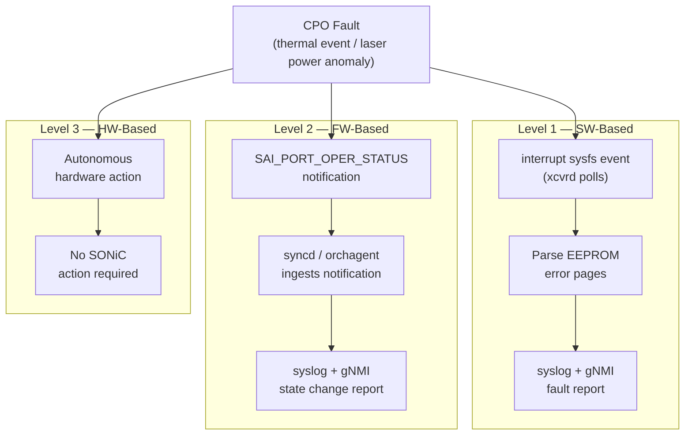

# SW-Controlled CPO (Co-Packaged Optics) #

## Table of Contents

- [1. Revision](#1-revision)
- [2. Scope](#2-scope)
- [3. Definitions/Abbreviations](#3-definitionsabbreviations)
- [4. Overview](#4-overview)
- [5. Requirements](#5-requirements)
- [6. Architecture Design](#6-architecture-design)
- [7. High-Level Design](#7-high-level-design)
  - [7.1. platform.json Changes](#71-platformjson-changes)
  - [7.2. SFP Object Model: One Object per Bank](#72-sfp-object-model-one-object-per-bank)
  - [7.3. Plug-in / Plug-out Event Handling](#73-plug-in--plug-out-event-handling)
  - [7.4. Bank-Aware EEPROM Access](#74-bank-aware-eeprom-access)
  - [7.5. Module Detection Flow (MDF) Changes](#75-module-driver-framework-mdf-changes)
  - [7.6. DOM and Monitoring Updates](#76-dom-and-monitoring-updates)
  - [7.7. Transition to Module-Type-ID-Based Transceiver API Selection](#77-transition-to-module-type-id-based-transceiver-api-selection)
  - [7.8. CPO as a Known CMIS Module Type](#78-cpo-as-a-known-cmis-module-type)
  - [7.9. SerDes SI and Module SI](#79-serdes-si-and-module-si)
  - [7.10. CmisCpoMemoryMap](#710-cmiscpomemorymap)
  - [7.11. Error Handling / Protection Schema](#711-error-handling--protection-schema)
  - [7.12. Firmware Upgrade](#712-firmware-upgrade)
- [8. SAI API](#8-sai-api)
- [9. Configuration and Management](#9-configuration-and-management)
  - [9.1. CLI/YANG Model Enhancements](#91-cliyang-model-enhancements)
  - [9.2. Config DB Enhancements](#92-config-db-enhancements)
- [10. Warmboot and Fastboot Design Impact](#10-warmboot-and-fastboot-design-impact)
- [11. Memory Consumption](#11-memory-consumption)
- [12. Restrictions/Limitations](#12-restrictionslimitations)
- [13. Testing Requirements/Design](#13-testing-requirementsdesign)
  - [13.1. Unit Test Cases](#131-unit-test-cases)
  - [13.2. System Test Cases](#132-system-test-cases)
- [14. Open/Action Items](#14-openaction-items)

---

## 1. Revision

| Rev | Date       | Author         | Change Description |
|-----|------------|----------------|--------------------|
| 0.1 | March 2026 | Tomer Shalvi   | Initial draft      |

---

## 2. Scope

This document describes the SONiC changes required to enable **SW-Controlled CPO (Co-Packaged Optics)** module support. It focuses on the platform integration layer, the SFP/transceiver object model, EEPROM access mechanisms, CMIS state machine compatibility, CLI extensions, and error protection handling.

The document covers changes in the following repositories:
- sonic-platform-common
- sonic-platform-daemons
- sonic-utilities
- Platform-specific code (Nvidia platform)

---

## 3. Definitions/Abbreviations

| Term    | Definition |
|---------|------------|
| CPO     | Co-Packaged Optics |
| CMIS    | Common Management Interface Specification |
| DOM     | Digital Optical Monitoring ??? |
| ELS     | External Laser Source |
| VDM     | Versatile Diagnostics Monitoring ??? |
| PM      | Performance Monitoring |
| SM      | State Machine |
| OE      | Optical Engine |
| FW      | Firmware |
| SW      | Software |
| MDF     | Module Detection Flow |
| SI      | Signal Integrity |
| SDK     | Software Development Kit |
| EEPROM  | Electrically Erasable Programmable Read-Only Memory |
| SAI     | Switch Abstraction Interface |
| gNMI    | gRPC Network Management Interface |

---

## 4. Overview

CPO modules are Co-Packaged Optics devices that combine electronic and optical functionality in a single pluggable module. Unlike conventional QSFP-DD or OSFP transceivers, a CPO module exposes a **multi-bank architecture**: each physical module contains four independent banks, each bank managing a subset of lanes.

Today, CPO modules are running in FW-control mode only. The purpose of this HLD is to transition CPO modules from FW-control to SW-control mode, where the NOS manages the module lifecycle directly rather than delegating control to the firmware — the same SW-control model used for traditional QSFP-DD/OSFP modules, presented in CMIS Host Mgmt. feature. 

---

## 5. Requirements

| # | Requirement |
|---|-------------|
| 1 | Support 16 CPO modules per platform (expandable), each with 4 banks and 32 SerDes lanes. |
| 2 | Represent each bank as a separate SFP object in `_sfp_list`. |
| 3 | Platform configuration must describe CPO topology via a new `"cpos"` section in `platform.json`. |
| 4 | EEPROM access for CMIS banked pages (0x10–0x1F) must use the bank-specific sysfs path. Non-banked pages use the legacy (bank0-equivalent) path. |
| 5 | Plug-in / plug-out events must be reported once per bank (four events per module) so that `xcvrd` maps them correctly to logical ports. |
| 6 | CPO module type ID (`0x80`) must be recognized as a CMIS module type, enabling the CMIS state machine. |
| 7 | Transceiver API selection must be driven dynamically by the module type ID, using a dedicated `CmisCpoMemoryMap` for CPO modules. |
| 8 | Existing `show interfaces transceiver` CLI commands must be extended to display 32-lane data and ELS information. |
| 9 | `sfputil` commands that access EEPROM must accept an optional `--bank` parameter. |
| 10 | A 3-level SW/FW protection schema must be implemented for thermal events and laser power anomalies. |
| 11 | The design must not disrupt warmboot/fastboot for non-CPO platforms. |
| 12 | MDF (module detection flow) requires no additional changes; CPO modules are CMIS 5.3 and are handled by the existing SW-control flow. |

---

## 6. Architecture Design

The design **does not introduce new daemons or major architectural components**. It extends the existing transceiver management stack as follows:



**Changed repositories:**

| Repository | Changed Component |
|---|---|
| `sonic-platform-common` | `XcvrApiFactory`, `CmisMemMap` (add `CmisCpoMemoryMap`), CMIS type list |
| `sonic-platform-daemons` | `xcvrd` — event handling, CMIS state machine, DOM polling |
| Platform plugin (Nvidia) | `Chassis`, `SFP`, `CpoPort`, `platform.json` schema |
| `sonic-utilities` | `show interfaces transceiver`, `sfputil` |

---

## 7. High-Level Design
TODO tomer to add CPO diagram + explanations here or in the overview
### 7.1. platform.json Changes

A new top-level `"cpos"` section is added to `platform.json`. It defines the CPO modules present on the platform and maps each module's lanes to their OE (Optical Engine), ELS, and laser indices.
Using this new top-level section, SONiC platform code will know how many CPO modules there are on the switch. 

Each interface entry in the `"interfaces"` section gains a `"bank"` field (0–3) indicating which bank of the parent CPO module it belongs to.

The following diagram illustrates the topology for one CPO module (cpo_0):



**Example (abbreviated):**

```json
{
    "cpos": {
        "cpo_0": {
            "lanes": {
                "0":  { "OE": "0", "ELS": "0", "laser": "0" },
                "1":  { "OE": "0", "ELS": "0", "laser": "0" },
                ...
                "31": { "OE": "0", "ELS": "0", "laser": "7" }
            }
        },
        "cpo_1": {
            "lanes": {
                "0":  { "OE": "1", "ELS": "1", "laser": "0" },
                ...
                "31": { "OE": "1", "ELS": "1", "laser": "7" }
            }
        },
        ...
        "cpo_15": {
            "lanes": {
                "0":  { "OE": "15", "ELS": "15", "laser": "0" },
                ...
                "31": { "OE": "15", "ELS": "15", "laser": "7" }
            }
        }
    },
    "interfaces": {
        "Ethernet0":  { "index": "1,1,1,1,1,1,1,1", "bank": 0, "lanes": "0,1,2,3,4,5,6,7",
                        "breakout_modes": { "2x400G[200G]": ["etp1","etp2"], "4x200G": ["etp1a","etp1b","etp2a","etp2b"], "8x100G": ["etp1a","etp1b","etp1c","etp1d","etp2a","etp2b","etp2c","etp2d"] } },
        "Ethernet8":  { "index": "2,2,2,2,2,2,2,2", "bank": 1, "lanes": "8,9,10,11,12,13,14,15", ... },
        "Ethernet16": { "index": "3,3,3,3,3,3,3,3", "bank": 2, "lanes": "16,17,18,19,20,21,22,23", ... },
        "Ethernet24": { "index": "4,4,4,4,4,4,4,4", "bank": 3, "lanes": "24,25,26,27,28,29,30,31", ... },
        ...
        "Ethernet512": { "index": "65,65,65,65,65,65,65,65", "bank": 3, ... }
    }
}
```

For a 16-CPO-module platform, the `"interfaces"` section contains 64 entries (4 banks × 16 modules = 64 logical ports, Ethernet0–Ethernet512 in steps of 8).

---

### 7.2. SFP Object Model: One Object per Bank

**Current behavior:** one `SFP` object is created per physical transceiver module.

**New behavior:** one `CpoPort` object is created per bank. For a 16-module CPO platform, `_sfp_list` contains 64 objects:

```
_sfp_list = [
    CpoPort(index=1,  bank=0),
    CpoPort(index=2,  bank=1),
    CpoPort(index=3,  bank=2),
    CpoPort(index=4,  bank=3),
    CpoPort(index=5,  bank=0),
    ...
    CpoPort(index=64, bank=3),
]
```

`bank_index` is derived as `sfp_index % NUMBER_OF_BANKS` (where `NUMBER_OF_BANKS = 4`).



**CPO port list extraction:**

```python
def extract_cpo_ports_index(port_type, num_of_asics=1):
    platform_file = os.path.join(device_info.get_path_to_platform_dir(),
                                 device_info.PLATFORM_JSON_FILE)
    if not os.path.exists(platform_file):
        return None
    cpo_ports = load_json_file(platform_file)['cpos']
    cpo_ports_count = len(cpo_ports.keys())
    return range(cpo_ports_count * NUMBER_OF_BANKS)
```

**SFP initialization:**

```python
def initialize_sfp(self):
    sfp_count = self.get_num_sfps()
    for index in range(sfp_count):
        asic_id = self._get_asic_id_by_sfp_index(index)
        if self.RJ45_port_list and index in self.RJ45_port_list:
            sfp_object = sfp_module.RJ45Port(index, bank_index=0, asic_id=asic_id)
        elif self.cpo_port_list and index in self.cpo_port_list:
            sfp_object = sfp_module.CpoPort(
                sfp_index=index,
                bank_index=index % NUMBER_OF_BANKS,
                asic_id=asic_id)
        else:
            sfp_object = sfp_module.SFP(sfp_index=index, bank_index=0, asic_id=asic_id)
        self._sfp_list.append(sfp_object)
    self.sfp_initialized_count = sfp_count
```

---

### 7.3. Plug-in / Plug-out Event Handling

The sequence below shows how a hardware event for CPO module 0 flows through the stack and results in four port-dict entries reaching `xcvrd`:



#### Shared sysfs per module

All four `CpoPort` objects belonging to the same physical module share the same sysfs paths for presence and interrupt monitoring (only EEPROM paths are bank-specific). To avoid redundant file-descriptor registration, the system registers only **one representative `CpoPort` per physical module** for sysfs polling.

The module-level sysfs index is derived from the object's SDK index:

```python
def is_cpo(self):
    return bool(self.cpo_port_list)

def get_sysfs_module_index(self):
    """Returns the sysfs module index.
    On CPO platforms, multiple SFP objects share a single physical module sysfs entry.
    """
    return self.sdk_index // NUMBER_OF_BANKS if self.is_cpo() else self.sdk_index
```

#### Polling one SFP per module

```python
def get_unique_sfps_by_module_index(sfp_list):
    unique_sfps = []
    seen_indexes = set()
    for sfp in sfp_list:
        module_index = sfp.get_sysfs_module_index()
        if module_index not in seen_indexes:
            seen_indexes.add(module_index)
            unique_sfps.append(sfp)
    return unique_sfps

def get_change_event_for_module_host_management_mode(self, timeout):
    if not self.poll_obj:
        self.poll_obj = select.poll()
        self.registered_fds = {}
        unique_sfp_list = get_unique_sfps_by_module_index(self._sfp_list)
        for s in unique_sfp_list:
            for fd_type, fd in s.get_fds_for_poling().items():
                if fd is None:
                    continue
                self.poll_obj.register(fd, select.POLLERR | select.POLLPRI)
                self.registered_fds[fd.fileno()] = (s.sdk_index, fd, fd_type)
    ...
```

#### Sysfs access uses module-level index

```python
def get_fd(self, fd_type):
    path = f'/sys/module/sx_core/asic0/module{self.get_sysfs_module_index()}/{fd_type}'
    try:
        return open(path)
    except FileNotFoundError:
        logger.log_warning(f'Trying to access {path} which does not exist')
        return None
```

#### Event propagation to xcvrd: four events per module

`xcvrd` uses `get_physical_to_logical(int(key))` to map a port-dict key to logical interface names. To ensure all four logical ports associated with a CPO module are updated correctly, the event must be reported **four times** (once per bank):

```python
def fill_change_event(self, port_dict):
    """Populate port_dict with state changes.

    For CPO modules, report one entry per bank (sdk_index+1 through sdk_index+4)
    so that xcvrd maps the event to all four logical ports.
    """
    if self.state in (STATE_NOT_PRESENT, STATE_FCP_NOT_PRESENT):
        for offset in range(1, NUMBER_OF_BANKS + 1):
            port_dict[self.sdk_index + offset] = SFP_STATUS_REMOVED
    elif self.state in (STATE_SW_CONTROL, STATE_FW_CONTROL, STATE_FCP_PRESENT):
        for offset in range(1, NUMBER_OF_BANKS + 1):
            port_dict[self.sdk_index + offset] = SFP_STATUS_INSERTED
    elif self.state in (STATE_POWER_BAD, STATE_POWER_LIMIT_ERROR):
        sfp_state = SFP.SFP_ERROR_BIT_POWER_BUDGET_EXCEEDED | SFP.SFP_STATUS_BIT_INSERTED
        for offset in range(1, NUMBER_OF_BANKS + 1):
            port_dict[self.sdk_index + offset] = str(sfp_state)
```

---

### 7.4. Bank-Aware EEPROM Access

The SDK exposes a new bank-indexed EEPROM sysfs path:

```
/sys/module/sx_core/asic0/moduleX/bankY/eeprom/pages
```

The legacy path continues to work and maps to bank 0:

```
# These two paths are equivalent:
/sys/module/sx_core/asic0/moduleX/eeprom/pages
/sys/module/sx_core/asic0/moduleX/bank0/eeprom/pages
```

CMIS defines pages 0x10–0x1F as bank-specific. All other pages use the legacy (module-level) path:



```python
CMIS_BANKED_PAGES = [
    0x10, 0x11, 0x12, 0x13, 0x14, 0x15, 0x16, 0x17,
    0x18, 0x19, 0x1A, 0x1B, 0x1C, 0x1D, 0x1E, 0x1F,
]

def _get_eeprom_path_for_page(self, page_num):
    if page_num in CMIS_BANKED_PAGES:
        return (SFP_SDK_MODULE_SYSFS_ROOT_TEMPLATE.format(self.get_sysfs_module_index()) +
                'bank{}/eeprom/pages'.format(self.bank_index))
    return self._get_eeprom_path()

def _get_page_and_page_offset(self, overall_offset):
    ...
    page_num = (overall_offset - page1h_start) // SFP_UPPER_PAGE_OFFSET + 1
    page = f'{page_num}/data'
    offset = (overall_offset - page1h_start) % SFP_UPPER_PAGE_OFFSET

    effective_path = self._get_eeprom_path_for_page(page_num)
    return page_num, os.path.join(effective_path, page), offset
```

---

### 7.5. Module Detection Flow (MDF) Changes

No additional MDF changes are required. CPO modules conform to CMIS 5.3 and follow the existing SW-control path. The MDF already handles CMIS modules via the SW-control path.

---

### 7.6. DOM and Monitoring Updates

The DOM thread periodically reads transceiver diagnostics and publishes them to Redis (DOM, VDM, PM, FW/HW status). Existing statistics are keyed by **logical port only**; the current schema requires no changes to support the metrics already published.

Additional statistics for **ELS monitoring** will be introduced via the new `CmisCpoMemoryMap` (see [Section 7.10](#710-cmiscpomemorymap)).

> **TODO:** Determine how to access the new ELS statistics and publish them to the appropriate Redis tables. (Details TBD — pending discussion with FW Arch team.)

---

### 7.7. Transition to Module-Type-ID-Based Transceiver API Selection

**Current (FW-controlled CPO) behavior:** the transceiver API is hard-coded to CMIS:

```python
# Workaround: CPO EEPROM was inaccessible; avoid exposing new type to community
self._xcvr_api = self._xcvr_api_factory._create_api(
    cmis_codes.CmisCodes, cmis_mem.CmisMemMap, cmis_api.CmisApi)
```

**New (SW-controlled CPO) behavior:** remove the `get_xcvr_api()` override from `CpoPort`. This allows `CpoPort` to inherit the standard `SFP` implementation, which selects the API based on the module-type ID read from the EEPROM.

The `XcvrApiFactory` is extended to map CPO module type ID `0x80` to the CMIS API with `CmisCpoMemoryMap`:



```python
def create_xcvr_api(self):
    id = self._get_id()

    id_mapping = {
        0x18: (self._create_cmis_api, ()),     # QSFP-DD
        0x19: (self._create_cmis_api, ()),     # OSFP
        0x80: (self._create_cmis_api, (CmisCpoMemoryMap,)),  # CPO
        ...
    }
    creator, args = id_mapping.get(id, (self._create_unknown_api, ()))
    return creator(*args)
```

---

### 7.8. CPO as a Known CMIS Module Type

For a port to enter the CMIS state machine, its module type must appear in the `CMIS_MODULE_TYPES` list. The CPO type is added:

```python
CMIS_MODULE_TYPES = ['QSFP-DD', 'QSFP_DD', 'OSFP', 'OSFP-8X', 'QSFP+C', 'CPO']
```

---

### 7.9. SerDes SI and Module SI

> **Blocked — pending SerDes team input.**

The SerDes team has confirmed that CPO modules require a dedicated TX DB configuration. Unlike standard modules, CPO uses an **nLUT** (a 255-entry value table).

> **TODO:** Obtain the new SI (Signal Integrity) parameters from the SerDes team. Once received:
> - Update the IM JSON files and the JSON generator script.
> - Update the SWSS ports OA if new SerDes SI parameters are introduced.

---

### 7.10. CmisCpoMemoryMap

A dedicated memory map `CmisCpoMemoryMap` will be introduced for CPO modules. It inherits from the existing `CmisMemMap` and adds all ELS fields defined in the CPO architecture specification.

```python
class CmisCpoMemoryMap(CmisMemMap):
    """Extends CmisMemMap with CPO-specific ELS fields."""
    ...  # ELS field definitions TBD with FW Arch team
```

> **TODO:** Consult with FW Arch team to determine the correct field offsets and access patterns for all new ELS fields.

---

### 7.11. Error Handling / Protection Schema

To manage CPO platform faults (thermal events and laser power anomalies), a **3-level Protection Schema** is implemented:

| Level | Mechanism | SONiC Action |
|-------|-----------|--------------|
| 1 — SW-Based | Monitor `interrupt` sysfs. Upon event, parse the relevant EEPROM error pages. | Report fault via syslog and gNMI. |
| 2 — FW-Based | Ingest SAI link-status-change notifications (see [Section 8](#8-sai-api)). | Report state change via syslog and gNMI. |
| 3 — HW-Based | Handled autonomously by platform hardware. | No SONiC action required. |



> **TODO:** Finalize implementation details for SW and FW protection mechanisms (exact EEPROM error-page offsets to parse and the specific SAI notification formats/attributes).

---

### 7.12. Firmware Upgrade

Two firmware upgrade paths exist for CPO:
- **ELS FW upgrade** — affects the ELS subsystem.
- **vModule FW upgrade** — affects the vModule coherent DSP.

> **TODO:** Determine whether SONiC work is needed here (will upgrades be performed via `mft` or `sfputil`?). If `sfputil` is used, investigate the correct bank-aware upgrade flow.

---

## 8. SAI API

No new SAI APIs are introduced by this design.

**FW-Based Protection (Level 2)** consumes existing SAI link-status-change notifications. The SAI notification delivers a `SAI_PORT_OPER_STATUS_NOTIFICATION` (or equivalent) which `syncd`/`orchagent` already processes. The SONiC-level change required is to recognise CPO-specific status codes within that notification and surface them via syslog and gNMI.

> **TODO:** Confirm exact SAI notification type and attribute values used for CPO FW-based protection with the SAI/FW teams.

---

## 9. Configuration and Management

### 9.1. CLI/YANG Model Enhancements

The following `sonic-utilities` commands are updated to support CPO:

#### `show interfaces transceiver`

| Command | Change |
|---------|--------|
| `show interfaces transceiver eeprom` | Add ELS information section |
| `show interfaces transceiver eeprom -d` | Extend to display ELS-specific DOM data |
| `show interfaces transceiver status` | Scale lane output from 8 to 32 lanes for CPO interfaces |
| `show interfaces transceiver error-status` | Add CPO-specific error condition codes |

All changes must maintain **downward compatibility**: existing non-CPO output format is unchanged.

#### `sfputil`

Commands that access EEPROM directly (`sfputil read-eeprom`, `sfputil write-eeprom`, `sfputil show eeprom`) must be updated to support an optional `--bank <0-3>` parameter. When `--bank` is omitted, the default bank is 0.

The output format for bank-specific EEPROM data must clearly indicate the active bank.

No YANG model changes are required at this time (transceiver data is not yet modelled in YANG).

---

### 9.2. Config DB Enhancements

No Config DB schema changes are required. CPO topology is described entirely via `platform.json`, which is platform-specific configuration consumed at initialization time rather than runtime configuration stored in Config DB.

---

## 10. Warmboot and Fastboot Design Impact

The CPO changes are confined to the transceiver platform layer and the `xcvrd` daemon. Neither path is in the warmboot/fastboot critical chain:

- `xcvrd` is not part of the fast-path restoration sequence; it runs after the data plane has resumed.
- The SFP object initialization (`initialize_sfp`) runs at `xcvrd` startup and is not in the boot-critical path.
- Sysfs-based event polling introduces no additional I/O to the boot-critical chain.
- The changes are gated on the presence of a `"cpos"` section in `platform.json`; on non-CPO platforms the behaviour is unchanged.

**Expected warmboot/fastboot impact: none.**

### Warmboot and Fastboot Performance Impact

- No stalls, sleeps, or additional I/O operations are added to the boot-critical chain.
- No CPU-heavy processing (e.g., Jinja template rendering) is added in the boot path.
- No third-party dependencies are updated.
- The `xcvrd` service can be considered for delayed startup if required.
- No degradation to warmboot/fastboot times is expected.

---

## 11. Memory Consumption

On a 16-CPO-module platform, the number of SFP objects in `_sfp_list` increases from 16 (one per module) to 64 (one per bank). Each `CpoPort` object has a small memory footprint comparable to an existing `SFP` object. The additional overhead is:

- **48 extra `CpoPort` instances** (64 − 16), each holding a bank index, a sysfs module index, and a reference to the transceiver API.
- Estimated additional memory per object: O(1 KB), totalling approximately **48 KB extra per platform**.

This memory is allocated at `xcvrd` startup and is constant thereafter (no growing consumption). On non-CPO platforms the feature incurs **zero additional memory** (the `"cpos"` section is absent from `platform.json` and the code path is not exercised).

---

## 12. Restrictions/Limitations

- CPO support is restricted to platforms that declare a `"cpos"` section in `platform.json`.
- SerDes SI parameter configuration for CPO is blocked until input is received from the SerDes team.
- ELS statistics publication to Redis is pending FW Arch alignment on field access patterns.
- FW upgrade procedure for ELS and vModule firmware is TBD.
- The protection schema EEPROM offsets and SAI notification mappings are TBD.

---

## 13. Testing Requirements/Design

### 13.1. Unit Test Cases

| ID | Description |
|----|-------------|
| UT-01 | Verify `extract_cpo_ports_index()` returns the correct range for a 16-CPO-module `platform.json`. |
| UT-02 | Verify `initialize_sfp()` creates 64 `CpoPort` objects with correct `bank_index` values (0–3 cycling). |
| UT-03 | Verify `get_sysfs_module_index()` returns `sdk_index // 4` for CPO and `sdk_index` for non-CPO. |
| UT-04 | Verify `get_unique_sfps_by_module_index()` returns exactly 16 objects (one per CPO module) from a 64-entry list. |
| UT-05 | Verify `_get_eeprom_path_for_page()` returns a bank-indexed path for pages 0x10–0x1F and the legacy path for other pages. |
| UT-06 | Verify `fill_change_event()` populates four entries in `port_dict` (one per bank) for each CPO module state transition. |
| UT-07 | Verify `create_xcvr_api()` instantiates `CmisApi` with `CmisCpoMemoryMap` for module type ID `0x80`. |
| UT-08 | Verify `CMIS_MODULE_TYPES` includes `'CPO'`. |
| UT-09 | Verify `sfputil read-eeprom --bank 2` routes the read to the correct bank-indexed sysfs path. |
| UT-10 | Verify non-CPO platforms are unaffected: `_sfp_list` length, sysfs paths, and event handling unchanged when `"cpos"` key is absent. |

### 13.2. System Test Cases

| ID | Description |
|----|-------------|
| ST-01 | **Transceiver Discovery:** Insert a CPO module and verify all four logical ports (one per bank) are discovered and appear in `show interfaces transceiver`. |
| ST-02 | **CMIS State Machine:** Verify all four banks of a newly inserted CPO module progress through the CMIS state machine to the `MODULE_READY` state. |
| ST-03 | **EEPROM Read (banked page):** Perform `sfputil read-eeprom --bank 0/1/2/3` on a banked page and verify bank-specific data is returned. |
| ST-04 | **EEPROM Read (non-banked page):** Perform `sfputil read-eeprom` on a non-banked page and verify the legacy path is used regardless of bank. |
| ST-05 | **Plug-out Event:** Remove a CPO module and verify four `SFP_STATUS_REMOVED` events are reported to `xcvrd`, one per bank. |
| ST-06 | **CLI — 32-lane status:** Verify `show interfaces transceiver status <CPO_PORT>` displays 32-lane data. |
| ST-07 | **CLI — error status:** Inject a CPO-specific fault and verify `show interfaces transceiver error-status` reports it correctly. |
| ST-08 | **Warmboot:** Trigger a warmboot on a platform with active CPO modules. Verify transceiver state is restored correctly and CMIS state machine re-converges. |
| ST-09 | **Non-CPO regression:** Run the full existing transceiver test suite on a non-CPO platform to confirm no regression. |

---

## 14. Open/Action Items

| # | Item | Owner | Status |
|---|------|-------|--------|
| 1 | DOM/ELS statistics: determine how to access new ELS statistics and publish them to Redis tables. | TBD (FW Arch + SW) | Open |
| 2 | SerDes SI parameters: obtain CPO-specific nLUT values from SerDes team; update IM JSON files and SWSS ports OA if required. | TBD (SerDes team) | Open |
| 3 | `CmisCpoMemoryMap` field definitions: consult FW Arch to determine exact EEPROM offsets and access patterns for all ELS fields. | TBD (FW Arch) | Open |
| 4 | Protection schema implementation: finalize exact EEPROM error-page offsets (SW protection) and SAI notification format/attributes (FW protection). | TBD | Open |
| 5 | Firmware upgrade: determine whether `sfputil` or `mft` will handle ELS FW upgrade and vModule FW upgrade; if `sfputil`, design the bank-aware upgrade flow. | TBD | Open |
| 6 | SAI notification: confirm with SAI/FW teams the exact notification type and attributes used for CPO FW-based protection. | TBD (SAI + FW) | Open |
